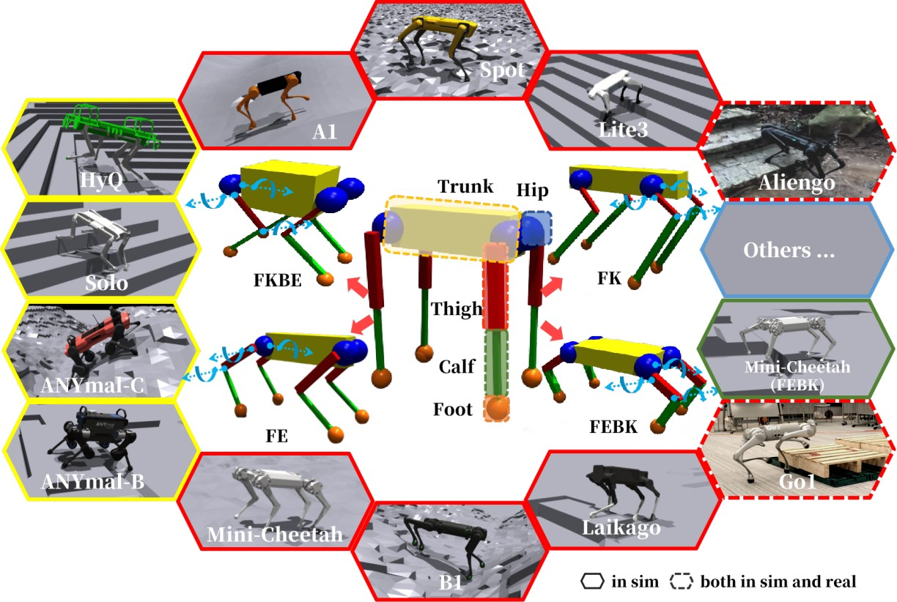

## 《MorAL: Learning Morphologically Adaptive Locomotion Controller for Quadrupedal Robots on Challenging Terrains》

**研究背景**
近年来，四足机器人在工业检测和探索等领域的应用日益广泛。与轮式机器人不同，四足机器人在不平整地形上的运动能力更强，但其较高的重心使其易于倾覆。目前，大多数学习型控制器都是为特定机器人设计的，这需要大量时间来调试每个新机器人的超参数。

**研究目标**
提出一种基于学习的控制框架——MorAL（Morphologically Adaptive Locomotion），能够适应不同形态的四足机器人和复杂地形。该框架同时训练控制策略和自适应模块，后者考虑了机器人的时间状态，从而使控制策略能够在线识别不同机器人平台的特性，并估计机器人的速度。

**方法介绍**
MorAL框架包括三个子网络：策略网络（policy net）、价值网络（value net）和形态网络（morph net），三者协同工作以实现对不同形态和地形的实时适应。在模拟环境中使用PPO（Proximal Policy Optimization）算法进行训练，形态网络的参数通过回归算法更新。

策略网络（Policy Net）：输入包括估计的身体速度、传感器数据和形态估计值，输出机器人的动作指令。
形态网络（Morph Net）：通过历史状态和动作数据来估计机器人的身体速度和形态，利用监督学习和策略损失共同优化。
价值网络（Value Net）：结合地形和形态信息，通过PPO算法训练，帮助策略网络推断并适应不同地形。
**主要贡献**
通用控制策略：提出的DRL（Deep Reinforcement Learning）控制策略在训练过程中统一考虑了机器人结构差异和地形多样性，避免了为每种特定机器人单独训练控制器的繁琐工作。
自适应形态识别：控制器能够在部署过程中隐式识别机器人的形态，无需传统的系统识别步骤。
应对复杂地形：MorAL框架使各种类型的机器人能够稳健地应对复杂地形，并且其自适应模块在机器人状态估计方面优于现有方法。
**实验验证**
大规模的实验表明，该控制器可以使具有显著不同形态的机器人在各种室内外复杂地形上顺利行走。MorAL框架的有效性在多个主流四足机器人（如HyQ、Go1、Spot、ANYmal等）上得到了验证。

**结论**
本文提出的MorAL框架在四足机器人运动控制领域具有重要意义，通过统一的控制策略和自适应能力，解决了跨平台部署的难题，提升了机器人在复杂环境中的适应性和稳健性。

