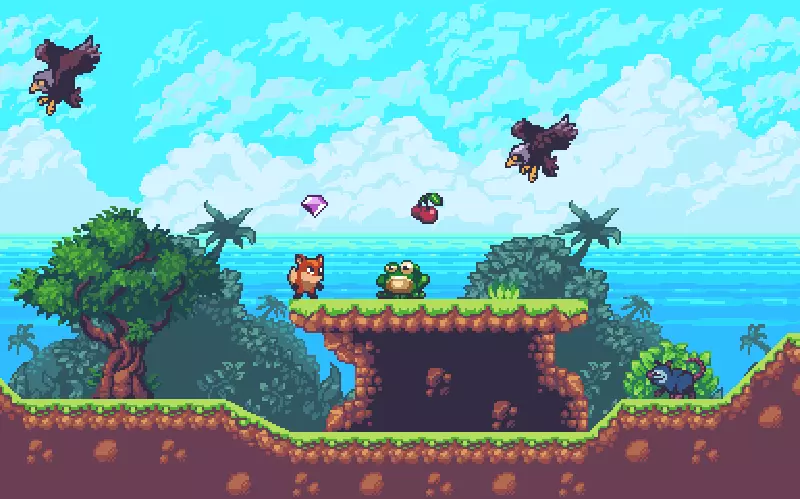

# Projects

**HoloCubic AIO**
一款多功能透明显示屏桌面站，你可以使用它作为你的个人终端。

2022年4月，我在一个偶然的机会上看到了稚晖君的开源项目[HoloCubic](https://gitee.com/peng_zhihui/HoloCubic), 并在此基础上结合开源固件[HoloCubic_AIO](https://gitee.com/ClimbSnailQ/HoloCubic_AIO)完成了它，我希望可以使用它实现更多有意思的功能。

**My work：**
1. 聚合多种APP，内置天气、时钟、相册、特效动画、视频播放、电脑投屏、web设置等等。
2. 提供web界面进行配网以及其他设置选项。

该项目的**硬件方案**基于ESP32PICO-D4，一个很实用的SiP芯片，整板面积做到一个硬币大小；**软件方面**基于lvgl-GUI库，移植了ST7789 1.3寸240x240分辨率屏幕的显示驱动，同时将MPU6050作为输入设备，通过感应的方式模拟编码器键值。

---

**OceanTech fish**

一款三波动鳍仿生鱼，我们期望它能作为**水路两栖仿生机器人**，应用于水文监测，管道探查等领域。

2021年5月，我作为电控组的成员参与了2021全国大学生OceanTech竞赛创新挑战赛，获得国家级二等奖1项。2021年8月，我们参加了第十届全国海洋航行器设计与制作大赛。获得国家级二等奖1项。

**My work：**

作为电控组成员，我主要负责波动鳍的**动力学编程**、以及**通信模块的优化**，它包括：
- 使用单独的舵机控制每个鳍条的运动，使机器人的鳍片产生不同的波形、以实现不同的运动姿态。
- 保证摄像头采集到的数据可以有效传输给客户端。

[**点击这里**](https://www.bilibili.com/video/BV1HY4y1579Y?spm_id_from=333.999.0.0)有我们早期演示的视频。

---

**RoboCup-MSL**

一款轮式足球机器人，我们期望使用它实现多机器人协同足球对抗赛。同时，它也可以作为年轻人的足球陪练伙伴。

2021年5月，我作为电控组的成员参与了 RoboCup 中型组竞赛。同时，我们赢得了中国赛的技术创新奖。2021年10月，我们参加了全国机器人锦标赛，获得国家级一等奖5项。2021年12月，我们参加了中国机器人及人工智能大赛，获得国家级一等奖1项。

**My work：**

作为电控组负责人，我负责研发机器人的**全部电控系统**，它包括：
- 设计均布式全向轮运动控制的硬件电路，通过CAN总线控制、PID算法、六轴IMU实现机器人底盘稳定运动。
- 自适应持球装置，持球时，结合地盘轮速与持球电机角度，解算持球电机的转速，以实现“车朝哪走，球向哪滚”。
- 电磁弹射系统，单板数字电路，实现对机器人击球系统的控制。
- 上下位机的通信协议

[**点击这里**](https://www.bilibili.com/video/BV1bv411P7pT/)有我具体工作的介绍视频。

---

**SunnyLand**

一款roguelike风格游戏，你可以使用它闯关冒险，Boss对战， 甚至多人联机对抗。

2020年12月，我和我的朋友在一门课程的作业中一起完成了它。

**My work：**

- 部分游戏逻辑代码的编写。在确定了角色和道具的功能和属性后，我设计并完成了部分逻辑的编写和调试。

- 设计地块和路径，绘制地图。我设计了整个游戏的情节和路线，玩家可以不断寻找一两个可能的路线和一些我遗漏的游戏蛋。

- 编写了一些小部件，如项目属性、血盒显示和其他小部件。

游戏引擎为Unity3D，编程语言为C#，主要角色和场景的美术资源来自Unity商店的资源包，关卡地图使用了Tiled Map Editor，代码方面使用了mvc框架，游戏角色运动控制使用了fsm状态机。

# **Awards**

2021RoboCup机器人世界杯中国赛技术创新奖
第二十三届全国机器人锦标赛半自主机器人足球赛5vs5一等奖
第二十三届全国机器人锦标赛自主导航无轨避障路径规划赛一等奖
第二十三届中国机器人及人工智能大赛全国总决赛一等奖
第十届全国海洋航行器设计与制作大赛《三波动鳍两栖仿生航行器》二等奖
第四届全国大学生嵌入式芯片与系统设计竞赛全国总决赛三等奖