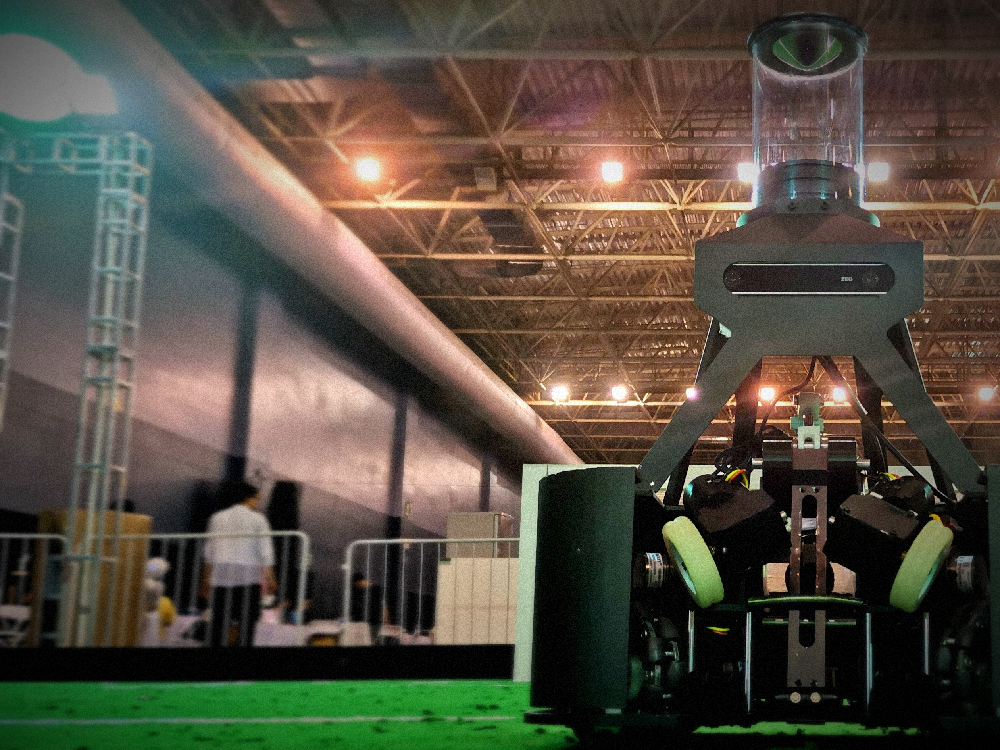

# Projects

**HoloCubic AIO**
A multifunctional transparent display desktop station, you can use it as your personal terminal.

In April 2022, I saw zhi Huijun's open source project [HoloCubic](https://gitee.com/peng_zhihui/HoloCubic) by chance, and completed it with the open source firmware [HoloCubic_AIO](https://gitee.com/ClimbSnailQ/HoloCubic_AIO) on this basis. I hope to use it to achieve more interesting functions.
**My work：**
1. A variety of apps, built-in weather, clock, photo albums, special effects animation, video playback, computer screen, Web Settings and so on.
2. Provides web interface for network configuration and other Settings.

The **hardware scheme** of the project is based on ESP32PICO-D4, a very practical SiP chip, the whole board area is the size of a coin; **Software** based on LVGL-GUI library, transplanted ST7789 1.3-inch 240x240 resolution screen display driver, at the same time, MPU6050 as the input device, through induction to simulate the encoder key value.

---

**OceanTech fish**

**A biomimetic fish with three unwave fins.** We expect it to be used as a water amphibious biomimetic robot in hydrology monitoring, pipeline exploration and other fields.

In May 2021, As a member of the electronic control group, I participated in the Innovation Challenge of 2021 National College Students OceanTech Competition and won one **national second prize**. In August 2021, we participated in the 10th National Ocean Vehicle Design and Production Competition. Won one **national second prize**.

**My work：**

As a member of the electronic control group, I was mainly responsible for dynamic programming of undulating fin and optimization of communication module, including:
- A separate steering gear is used to control the movement of each fin bar, so that the robot's fin can generate different waveforms to achieve different motion posture.
- Ensure that the data collected by the camera can be effectively transmitted to the client.

[**Click here**](https://www.bilibili.com/video/BV1HY4y1579Y?spm_id_from=333.999.0.0) for a video of our early demo.

---

**RoboCup-MSL**

A wheeled football robot, we expect to use it to achieve multi-robot collaborative football competition. At the same time, it can also serve as a training partner for young people.

In May 2021, I participated in the RoboCup Medium group competition as a member of the electronic control team. At the same time, we won the Technology Innovation award of China Competition. In October 2021, we participated in the National Robot Championship and won 5 national first prizes. In December 2021, we participated in China Robot and Artificial Intelligence Competition and won one national first prize.

**My work：**

As the head of the electronic control group, I am responsible for the development of **all the electronic control systems of the robot**, including：
- The hardware circuit of uniformly distributed omnidirectional wheel motion control is designed, and the stable motion of robot chassis is realized through CAN bus control, PID algorithm and six-axis IMU.
- The self-adaptive ball holding device can calculate the speed of the ball holding motor in combination with the wheel speed of the site and the Angle of the ball holding motor when holding the ball, so as to realize "where the car goes, the ball rolls".
- Electromagnetic ejection system, single board digital circuit, realize the control of the robot hitting system.
- The communication protocol of the upper and lower computers

[**Click here**](https://www.bilibili.com/video/BV1bv411P7pT/) for an introduction video of my work.

---

**SunnyLand**

A roguelike style game, you can use it through level adventures, Boss battles, and even multiplayer online confrontation.

In December 2020, MY friend and I finished it together in an assignment for a course.

**My work：**

- Part of the game logic code writing. After deciding on the functions and properties of the characters and props, I was involved in writing and debugging some of the logic.

- Designing plots and paths and drawing maps. I designed the entire game’s plot and the route, and players can keep trying to find one or two possible routes and some game eggs that I left out.

- Some gadgets are written, such as item properties, blood box display and other widgets.

The game engine is Unity3D, the programming language is C#, the art resources of the main characters and scenes come from the resource pack of Unity store, the level Map uses Tiled Map Editor, the code uses MVC framework, and the game character movement control uses FSM state machine.

# **Awards**

May 2021, Technical Innovation Award of roboCup China

October 2021, First prize 5VS5 of the 23rd National Robot Championship Semi-autonomous Robot Football Match

October 2021, First prize of the 23rd National Robot Championship Autonomous Navigation Trackless obstacle Avoidance Path Planning Competition

December 2021, First prize of the 23rd China Robot and Artificial Intelligence Competition National Finals

August 2021, Second prize of the 10th National Ocean Vehicle Design and Production Competition "Three Unwave fin amphibious bionic Vehicle" 

November 2021, Third prize in the fourth National College Students Embedded Chip and System Design Competition

