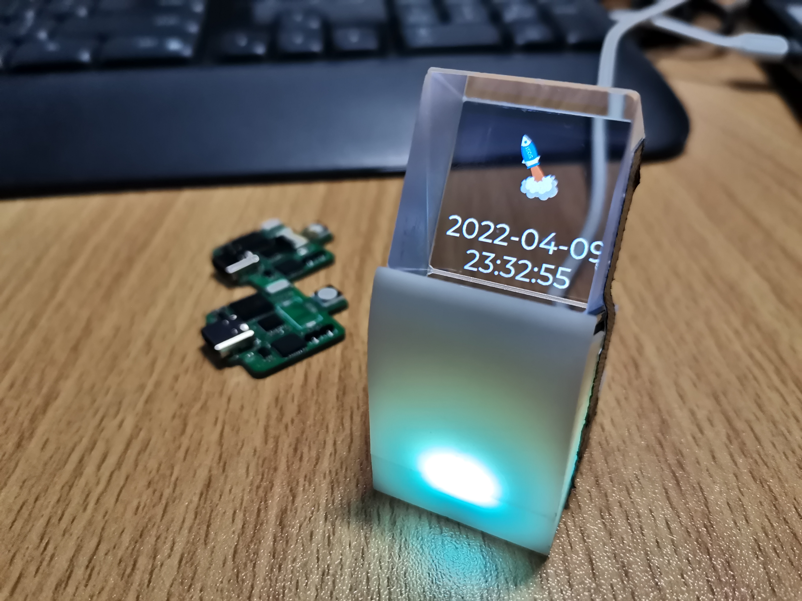
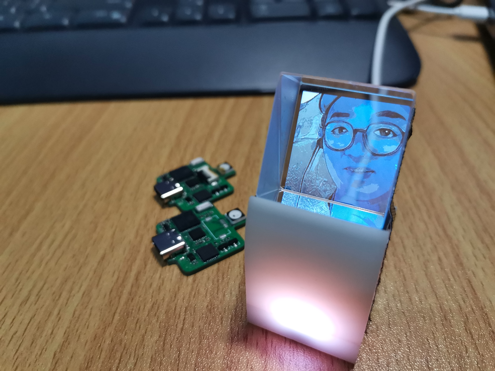
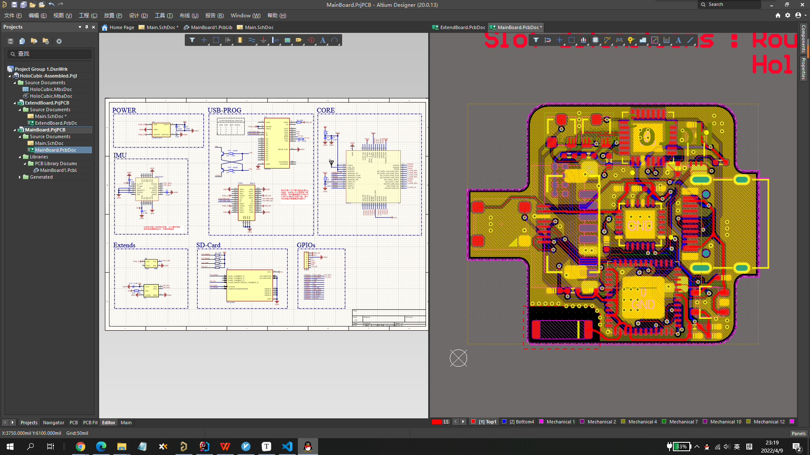

## **HoloCubic--多功能透明显示屏桌面站**
HoloCubic是一款多功能透明显示屏桌面站，你可以使用它作为你的个人终端。

2022年4月，我复现了稚晖君的开源项目[HoloCubic](https://gitee.com/peng_zhihui/HoloCubic), 并在此基础上结合开源固件[HoloCubic_AIO](https://gitee.com/ClimbSnailQ/HoloCubic_AIO)添加了很多有意思的功能.

该项目的**硬件方案**基于ESP32PICO-D4，一个很实用的SiP芯片，整板面积做到一个硬币大小；**软件方面**基于lvgl-GUI库，移植了ST7789 1.3寸240x240分辨率屏幕的显示驱动，同时将MPU6050作为输入设备，通过感应的方式模拟编码器键值。

## **主要特点**
1.聚合多种APP，内置天气、时钟、相册、特效动画、视频播放、电脑投屏、web设置等等。（各APP具体使用参考说明书）

2.开机无论是否插接tf卡、mpu6050是否焊接正常、是否连接wifi（一定要2.4G的wifi），都不影响系统启动。

3.程序相对模块化，低耦合。

4.提供web界面进行配网以及其他设置选项。注：具体操作参考APP介绍

5.提供web端连入除了支持ip访问，也支持域名直接访问 http://holocubic （部分浏览器可能支持不好）

6.提供web端的文件上传到SD卡（包括删除），无需拔插SD来更新图片。
提供全套上位机软件，并开源上位机源码。 

<!-- 2021年10月，全国机器人锦标赛, 斩获国家级一等奖多项。

2021年11月，中国机器人及人工智能大赛, 国家级一等奖一项。 -->

