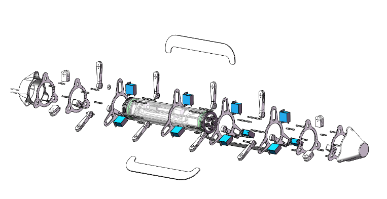
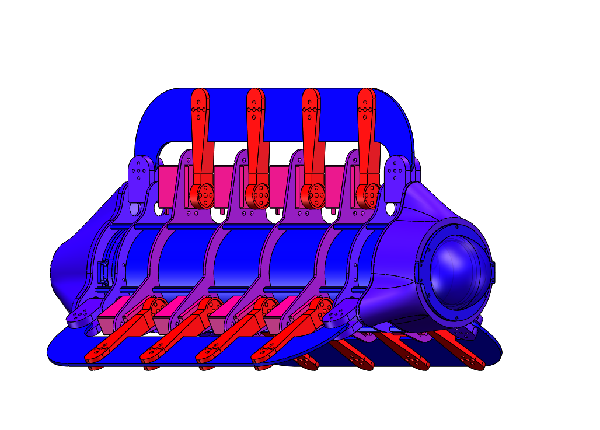

## **OceanTech Fish--三波动鳍仿生鱼**
## **简介**
2021年5月，我作为电控组的成员参与了2021全国大学生OceanTech竞赛创新挑战赛，获得国家级二等奖1项。2021年8月，我们参加了第十届全国海洋航行器设计与制作大赛。获得国家级二等奖1项。

作为电控组成员，我主要负责波动鳍的动力学编程以及通信模块的优化。

## **项目背景**
鱼类优良的游动运动方式给人类提高水下机器人推进系统的推进性能及与水环境的适应与交互性能带来了启迪，鱼类游动推进模式和仿鱼推进技术日趋成为水下推进器领域研究的热门方向。

MPF中的长鳍波动式现已有对双波动鳍和四波动鳍的研究，没有对于三波动鳍的可行性的研究。故对于三波动鳍是否有更高的推进效率、双波动鳍及四波动鳍不具备的优点如稳定性与平衡性的研究十分重要。

我们期望它实现**水路两栖**：用单独的舵机控制每个鳍条的运动：分别控制鳍条的运动使其具有更好的机动性，并且通过舵机的单独控制可以使他们调节到受到相对小的阻力，并且具有良好的同步性，达到闭环控制的效果。
## **项目方案**

通过算法使STM32H7芯片在接收到九轴传感器数据后对水下机器人进行运动学正解解算与分析，然后通过RS232协议将期望轨迹发送给舵机PWM信号发生板，最后PWM信号发生板通过改变占空比使舵机以规定速度拉动刚性鳍条运动，从而使鳍面成为预期形状并产生稳定推力；

通过改变机器人内部丝杆滑块位置实现自稳定。舵机内控制板通过编码器对舵机进行调整，实现了整个系统的闭环控制。基于5.8G的无线电信号被我们用作图传与远程通讯用途，使我们能远程得到无人机正前方视场角为130°的图像、通过传回数据对水下无人机进行远程参数调整与控制。

我们通过舵机与刚性鳍条来控制整个波动鳍的变化，具有结构简单、自重小、精度高、动态响应快等优良特性。特别适合用于高精度，低荷载且需要强机动能力的水下作业环境中。波动鳍水下无人机的应用在不同领域正在飞速扩展，对波动鳍推进进行全面的系统研究并实际应用有着非常重要的实际价值。

## **奖项**
依托此平台，我与我的团队成员斩获国家级二等奖两项

第十届全国海洋航行器设计与制作大赛《三波动鳍两栖仿生航行器》二等奖 2021.08

2021全国大学生OceanTech竞赛创新挑战赛二等奖 2021.05
## **图片**

