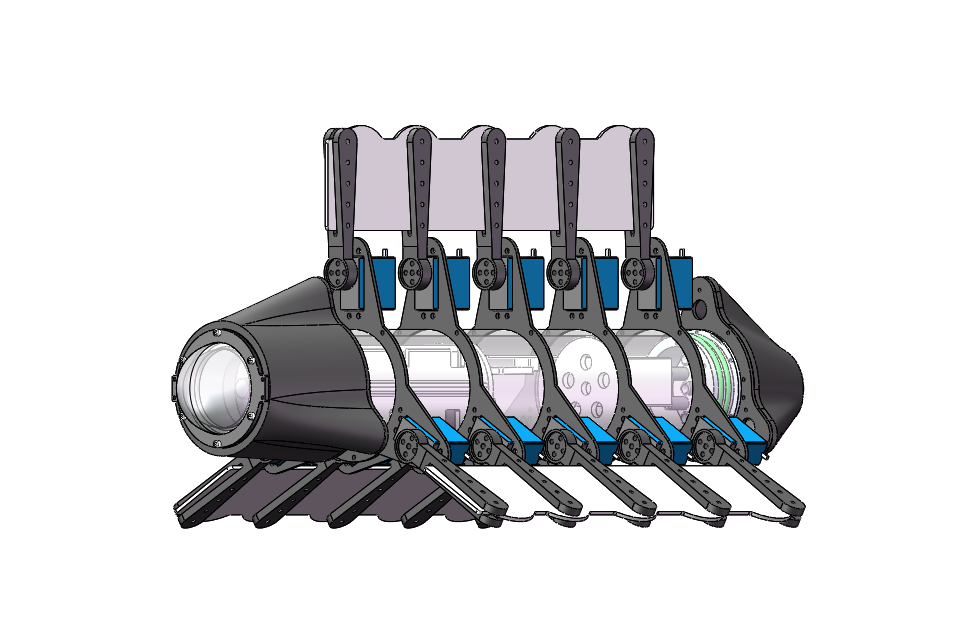

<!-- ## **OceanTech Fish--三波动鳍仿生鱼** -->
## **简介**
**OceanTech fish**是一款三波动鳍仿生鱼，我们期望它能作为**水路两栖仿生机器人**，应用于水文监测，管道探查等领域。

2021年5月，我作为电控组的成员参与了2021全国大学生OceanTech竞赛创新挑战赛，获得国家级二等奖1项。2021年8月，我们参加了第十届全国海洋航行器设计与制作大赛。获得国家级二等奖1项。

作为电控组成员，我主要负责波动鳍的**动力学编程**、以及**通信模块的优化**，它包括：
- 使用单独的舵机控制每个鳍条的运动，使机器人的鳍片产生不同的波形、以实现不同的运动姿态。
- 保证摄像头采集到的数据可以有效传输给客户端。

[**点击这里**](https://www.bilibili.com/video/BV1HY4y1579Y?spm_id_from=333.999.0.0)有我们早期演示的视频。

---

## **技术细节**
<!--  -->

**运动控制：**
采用单独的舵机控制每个鳍条的运动：分别控制鳍条的运动使展现不同的运动姿态

**驱动方案：**
使用STM32H7芯片，通过算法使STM32H7芯片在接收到九轴传感器数据后、对水下机器人进行运动学正解解算与分析，使用RS232协议将期望轨迹发送给舵机PWM信号发生板，最后PWM信号发生板通过改变占空比使舵机以规定速度拉动刚性鳍条运动，从而使鳍面成为预期形状并产生稳定推力；

**姿态控制：**
通过改变机器人内部丝杆滑块位置实现自稳定。舵机内控制板通过编码器对舵机进行调整，以实现整个系统的闭环控制。

**数据传输：**
基于5.8G的无线电信号被我们用作图传与远程通讯用途，我们能以此远程得到无人机正前方视场角130°的图像、通过传回数据对水下无人机进行远程参数调整与控制。

**舵机simulink仿真**

Matlab/Simulink提供了基本的功能模块。在Matlab中运行Simulink，根据系统结构图，在不考虑负载力矩M的影响下，代入相应参数后得到仿真实例。

**CFD方法-波动鳍周围速度场模拟仿真**

航行器两侧水流速度较快, 前端和后端水流速度较慢。在波动鳍运动的过程中会有涡产生，该涡分布于波动鳍面的周围并呈现反出卡门涡街的形式，这种形式的涡会形成一股中央射流，而射流是产生推进力重要的来源和标志。

**手机客户端**

使用快速开发工具blynk、开发波动鳍控制器手机APP，它可以实现对航行器的方向、速度、深度的实时监测与状态控制；当发生紧急情况时，系统会及时报警、紧急关闭。

---
## **奖项**
依托此平台，我与我的团队成员斩获国家级二等奖两项

2021全国大学生OceanTech竞赛创新挑战赛二等奖 2021.05

第十届全国海洋航行器设计与制作大赛《三波动鳍两栖仿生航行器》二等奖 2021.08

## **图片**

