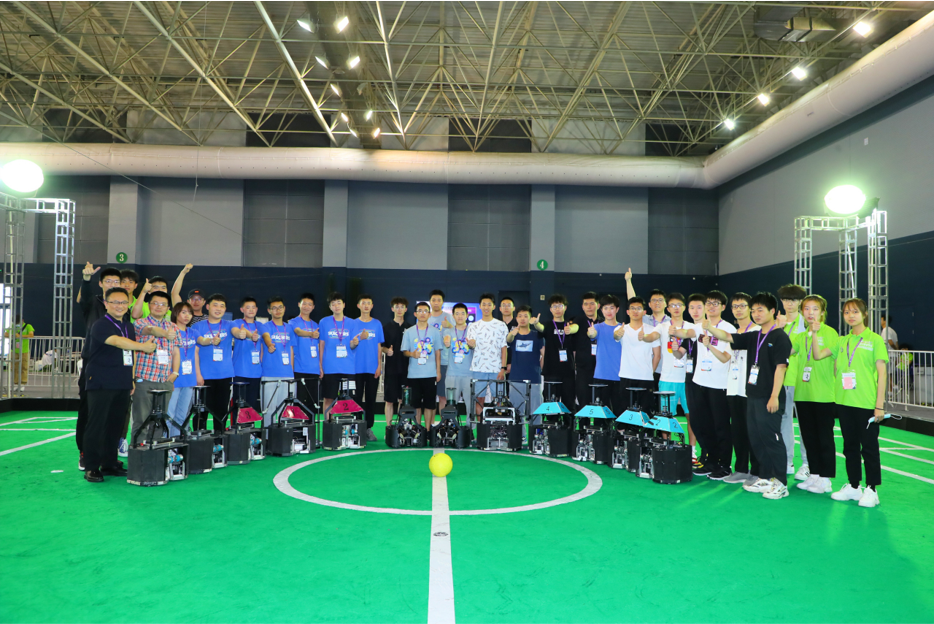
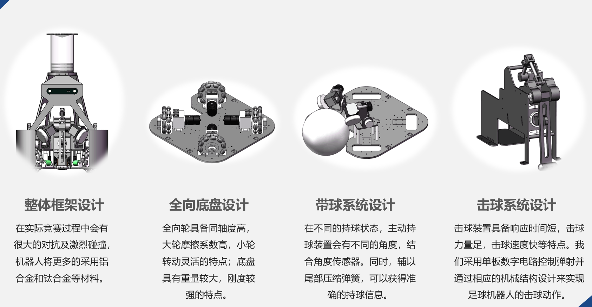
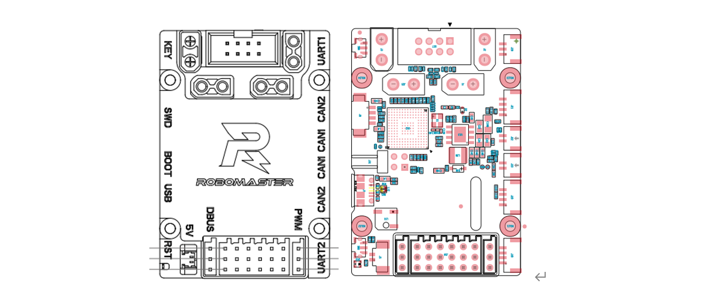
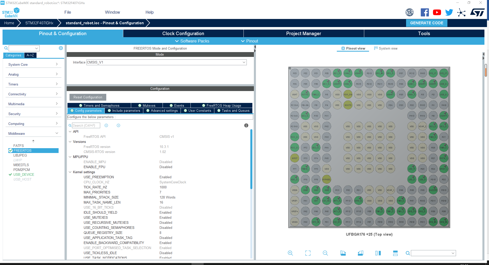
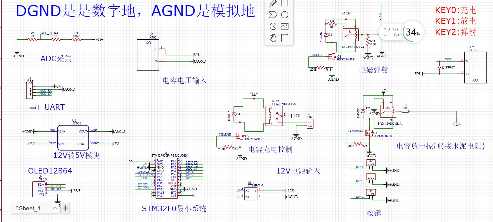
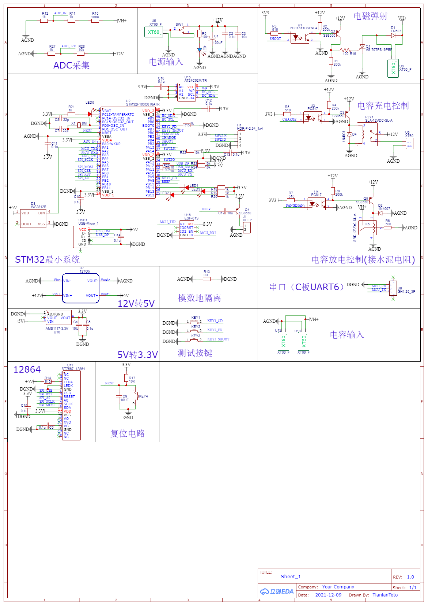
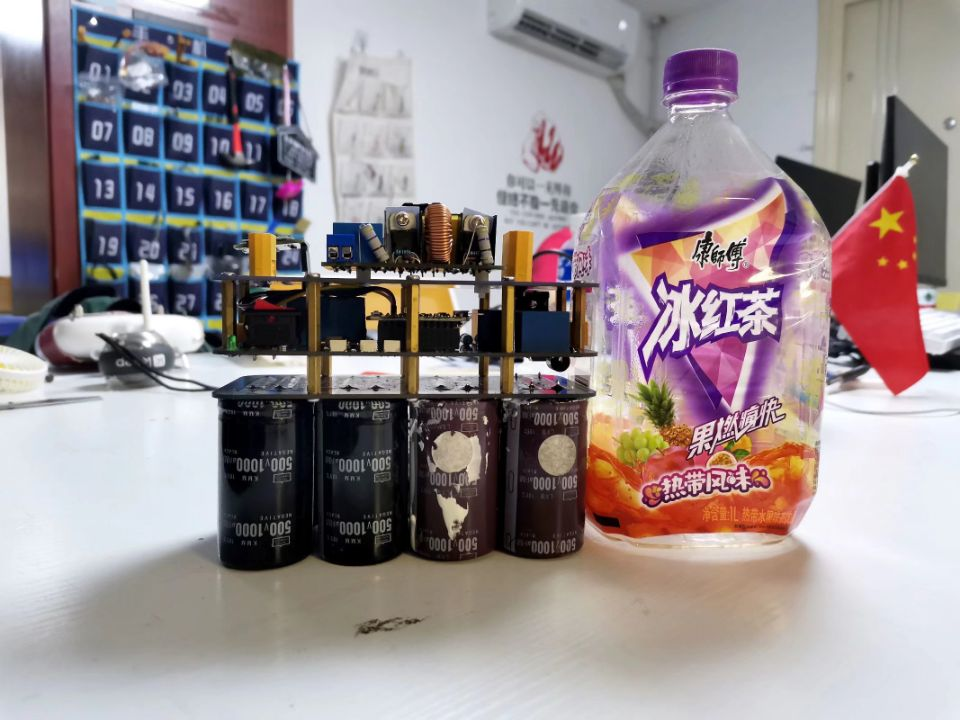
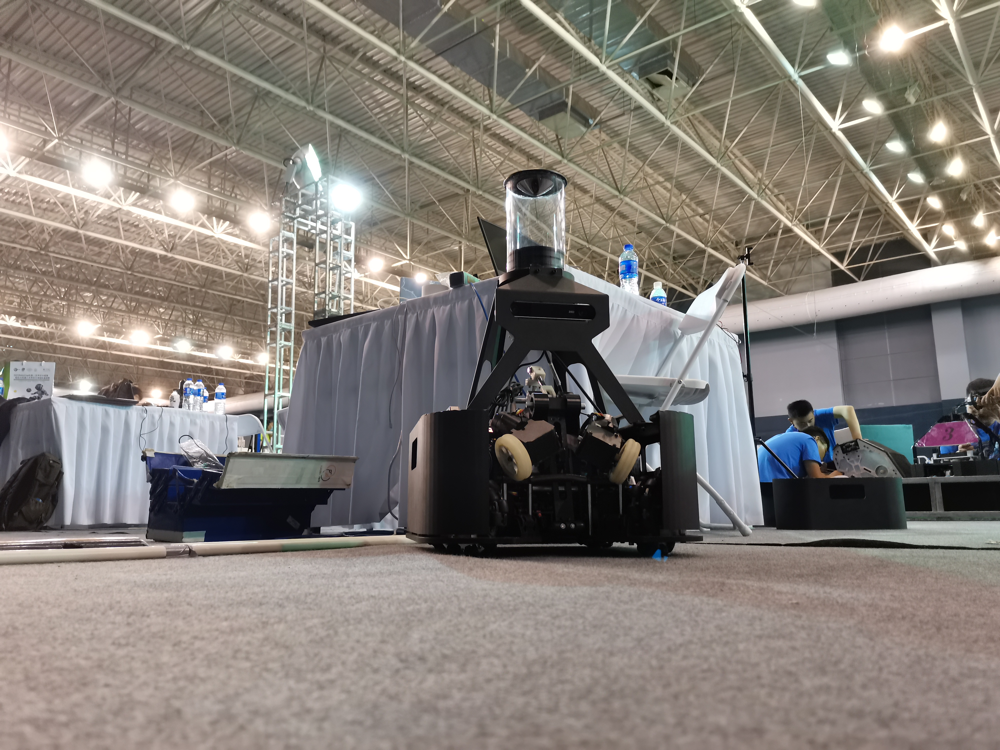
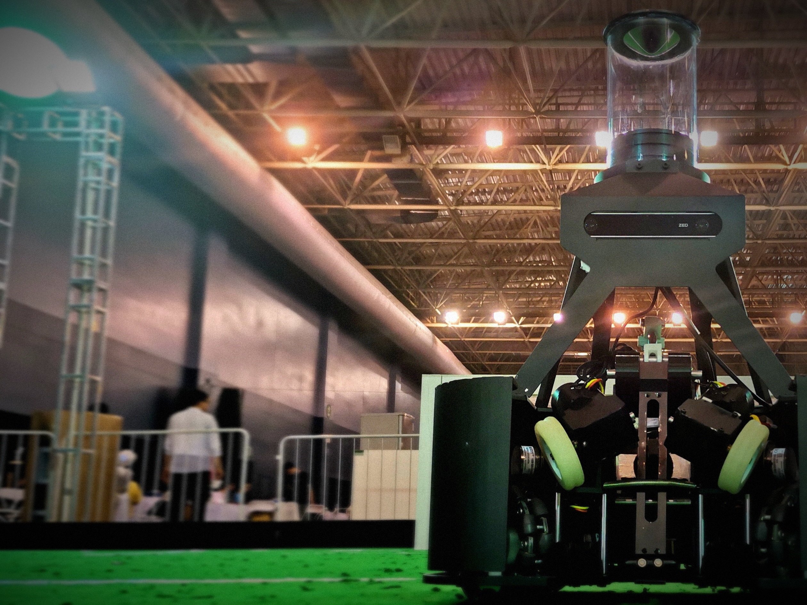

## **简介**
2021年5月，我作为电控组的成员参与了 RoboCup 中型组竞赛。同时，我们赢得了中国赛的技术创新奖。

<!-- 2021年10月，全国机器人锦标赛, 斩获国家级一等奖多项。

2021年11月，中国机器人及人工智能大赛, 国家级一等奖一项。 -->

## **技术细节**
我负责研发机器人的电控系统。[**点击这里**](https://www.bilibili.com/video/BV1bv411P7pT/)有我具体工作的介绍视频。下文中，我将从机械结构和硬件电控两个部分去介绍我具体负责的工作

<!-- **机械总体**可分为：**地盘、持球、击球**3个模块

**硬件总体**可分为：**主控、电磁弹射、持球状态采集**3个系统 -->

---
**机械部分：**

**地盘部分**采用互成90°角均布的四个全向轮作为机器人的运动部件，整个移动平台的材料全部采用不锈钢钣和铝合金面板。

**持球部分**使用3508减速电机与摩擦轮作为我们的带球装置，电机与摩擦轮之间采用锥齿轮传动，两侧的主动持球装置成八字放置，持球系统侧板安装有角度传感器，检测不同的持球状态。

**击球部分**为了实现平射与挑射，我们采用舵机控制舵盘连接块旋转，带动一级铝柱，活动轴，二级铝柱，击球连接块，使舵机的小角度转动，实现击球杆的升降。击球模块以两块钣金作为主体结构，中间用铝柱连接，采用方形插孔的设计安装电路板与电磁弹射支架。 

---
**硬件部分**：

**主控系统**采用了stm32F407IGH6TR作为主控芯片，基于大疆RoboMaster开发板C型作为下位机主控系统，支持宽电压输入，集成专用的扩展接口，通信接口以及高精度的IMU传感器。
<!--  -->
我在写核心代码时，参考了大疆 **[RoboMaster2020 自组版开源步兵**](https://github.com/RoboMaster/Development-Board-C-Examples)，利用stm32cubemx进行基础配置，采用freertos实时操作系统进行线程管理。 系统大致分为以下几个线程: 设备校准，地盘任务，监测设备，imu任务，led闪烁，OLED显示，电池电压检测，舵机控制，持球任务，角度传感器采集任务，电磁弹射任务，以及用于通信的USB发送，接收，解包任务。 
<!--  -->

**电磁弹射部分**以stm32f1系列芯片作为控制单元，控制电容的充电，放电，以及电磁线圈的导通，发射。 
<!--  -->
三层板设计，底部的电容版用于并联8个450V陶瓷电容，中间的主控板用于放置stm32f1，继电器，可控硅等控制部件，上层板放置升压板和水泥电阻，板层之间通过铜柱导电。 

**持球状态采集**部分，我绘制了一块ADC采集板，它在采集到角度传感器的信息后，通过串口给C板发送角度信息。

---
## **开源&奖项**

依托此平台, 我和我的团队成员斩获多枚国家级奖项, 这里是[**电控系统开源链接**](https://gitee.com/Lu-Yidan/standard_robot.git)

2021RoboCup机器人世界杯中国赛技术创新奖 2021.05 

第二十三届全国机器人锦标赛半自主机器人足球赛5vs5一等奖 2021.10 

第二十三届全国机器人锦标赛自主导航无轨避障路径规划赛一等奖 2021.10 

第二十三届中国机器人及人工智能大赛全国总决赛一等奖 2021.12

第四届全国大学生嵌入式芯片与系统设计竞赛全国总决赛三等奖 2021.11
## **图片**
<!--  -->

