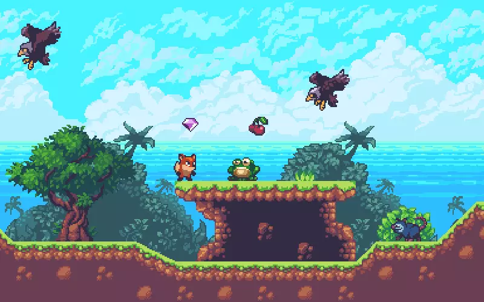

## **简介**

SunnyLand是一款roguelike风格游戏，完成于2020.12。

你可以使用它闯关冒险，Boss对战， 甚至多人联机对抗。

游戏引擎为Unity3D，编程语言为C#，主要角色和场景的美术资源来自Unity商店的资源包，关卡地图使用了Tiled Map Editor，代码方面使用了mvc框架，游戏角色运动控制使用了fsm状态机。由于年代过于久远，再加上工程文件体积过于庞大，故在写这篇博客的2022.05，很多资料已经不可考，故这里没有放开源链接与演示视频

